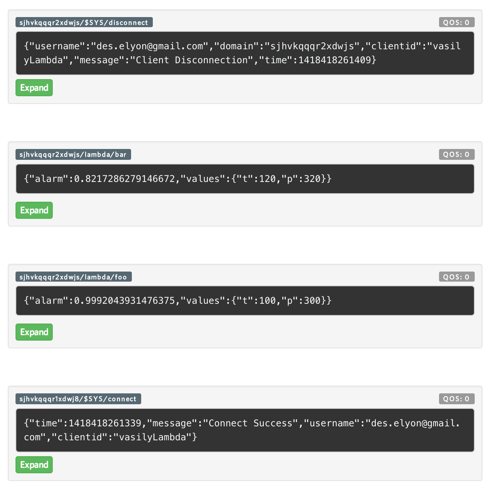
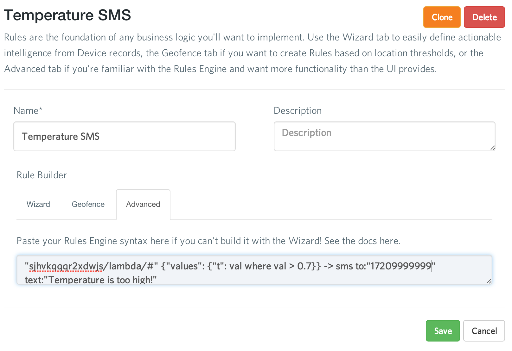

# Adding Intelligence to Amazon Lambda

## Introduction

You might have noticed that we at 2lemetry are pretty excited about Amazon's newest AWS product [Lambda](http://aws.amazon.com/lambda/). Several of our engineers [experimented](http://2lemetry.com/tag/lambda/) with how lambdas work together with the MQTT protocol and [ThingFabric](https://app.thingfabric.com). I decided to work on a small experiment with real computations to see how neural networks can be used inside lambdas in the context of the Internet of Things. I'm going to heavily utilize the S3/MQTT foundation described by Kyle, our CEO, in his recent [blog post](http://2lemetry.com/2014/12/05/native-mqtt-lambda/).

## Use Case

It's easy to imagine a large facility or a factory that has thousands of different sensors in various combinations. Let's imagine that a factory has hydraulic pumps along the assembly line with two major sets of sensors for temperature and pressure. Certain temperature and pressure combinations are hazardous and should trigger an alarm at the low alarm threshold and shut them off completely at the high threshold. However, because of various factors, the relationship between temperature, pressure, and alarm signal can't be described with a concrete equation. In cases like this machines learning can be used.
 
In my Lambda experiment I decided to emulate this scenario in which pairs of sensors report their values to some kind of centralized hub every few seconds and then the hub deploys a combined payload snapshot to Amazon S3, which triggers a lambda with a neural network in it, and then, finally, publishes an MQTT message to ThingFabric if the alarm value is greater than a certain threshold. On the ThingFabric end we'll setup some rules that will send a text message and shut off the device completely by sending another MQTT message.
 
## Setting Up Lambda
 
To better understand how we should setup our lambda let's describe all events that are going to happen in the system:
 
- A payload with temperature and pressure values is deployed to a specific S3 bucket.
- Our lambda is triggered.
- A neural network is initialized with an appropriate training set.
- Neural network sequentially evaluates payload values and triggers an MQTT publish call to a specific topic in ThingFabric.
- ThingFabric receives a message and does something meaningful with it (e.g., shuts off a valve, sends a text message or email, etc.).
 
Now that we have a better understanding of what's going at the high level let's setup our lambda. First, create a lambda on the new lambda AWS page and assign a role to it that has access to the S3 bucket that you are going to use for your payload deployments.
 
Now, let's write some boilerplate code for our lambda!

``` javascript
var aws = require('aws-sdk');
var s3 = new aws.S3({apiVersion: '2006-03-01'});
var brain = require("brain");
var mqtt = require('mqtt');

var config = {
  mqtt: {
    clientId: "<CLIENT ID>",
    username: "<THING FABRIC USERNAME>",
    md5Pass: "<THING FABRIC MD5 PASSWORD>",
    outputTopic: "<THING FABRIC DOMAIN>/lambda"
  },
  alarm: {
    maxTemp: 200,
    maxPressure: 800,
    alarmThreshold: 0.6
  }
};

exports.handler = function(event, context) {
  return context.done(null);
};
```

Here we just setup some initial config variables for the lambda and the main event handler. We are going to rely on these variables in the MQTT connection and the neural network. The cool thing about Amazon Lambda is that you can use almost any Node.js library in your projects. You'll have to install all of your libraries locally in the same directory as your project, since Amazon doesn't have any facilities that would allow it to process `package.json`. In our example, we are only using three Node libraries: `aws-sdk`, `brain`, and `mqtt`. Once you install them in the `./node_modules` folder, you are good to go.
 
## Parsing S3 Payloads and Sending MQTT messages

As I mentioned earlier, Kyle's already [described](http://2lemetry.com/2014/12/05/native-mqtt-lambda/) how to parse S3 payloads and easily send MQTT messages to ThingFabric in great detail, so I'm only going to briefly cover it here. First, let's describe the data format for our payloads. I decided to keep it minimal and only include a device ID that corresponds to a specific MQTT topic and a temperature/pressure sensor value pair. It looks something like this:

``` javascript
{ device_id: "foo", values: { t: 100, p: 400 } },
{ device_id: "bar", values: { t: 120, p: 320 } },
{ device_id: "foobar", values: { t: 90, p: 220 } }
```

In order to parse an object from S3 let's create a simple helper parser:

``` javascript
function S3Parser() {
  var _this = this;

  _this.parseS3Object = function(cb) {
    var s3 = new aws.S3({apiVersion: '2006-03-01'});

    s3.getObject({
      Bucket: event.Records[0].s3.bucket.name,
      Key: event.Records[0].s3.object.key
    }, function (err, data) {
      return cb(JSON.parse(data.Body.toString()));
    });
  };
}
```

Now let's write a simple MQTT client:

``` javascript
function MqttClient(config, onClose, onError) {
  var _this = this;
  _this.username = config.username;
  _this.pass = config.md5Pass;
  _this.clientId = config.clientId;

  _this.client = mqtt.connect(
      "mqtt://" + _this.username + ":" + _this.pass + "@q.m2m.io:1883", { "clientId": _this.clientId }
  );

  _this.client.on("close", onClose);

  _this.client.on("error", function(error) { onError(error) });

  _this.publish = function(topicName, payload) {
    return _this.client.publish(topicName, JSON.stringify(payload));
  };
  
  _this.disconnect = function() {
    return _this.client.end();  
  };
}
```

Now we have all of the boilerplate code setup, so let's add some neural network logic! 

## Adding a Neural Network

I'm going to use a neural network implementation by [Brain.js](https://github.com/harthur/brain) in our lambda. All it needs is a training dataset that in our case will look like this:

``` javascript
var trainingData = [
  { input: { t: 10, p: 275 }, output: { alarm: 0 } },
  { input: { t: 14, p: 230 }, output: { alarm: 0 } },
  { input: { t: 65, p: 240 }, output: { alarm: 0 } },
  { input: { t: 89, p: 301 }, output: { alarm: 1 } },
  ...
];
```

These are alarm values that were added by a human supervisor who knows for sure when the alarm should be triggered. In our case we don't need very many values to get to a small training error. I only used 19 values to get good and stable neural network outputs.

Once we have our training data, let's setup the alarm object that does all the interesting work in our lambda:

``` javascript
function Alarm(config) {
  var _this = this;

  _this.maxTemp = config.maxTemp;
  _this.maxPressure = config.maxPressure;
  _this.alarmThreshold = config.alarmThreshold;
  _this.nn = new brain.NeuralNetwork();

  _this.tempToInput = function(t) {
    return t / _this.maxTemp;
  };

  _this.pressureToInput = function(p) {
    return p / _this.maxPressure;
  };

  _this.parseTrainingData = function(data) {
    return data.map(function(point) {
      return {
        input: { t: _this.tempToInput(point.input.t), p: _this.pressureToInput(point.input.p) },
        output: { alarm: point.output.alarm }
      }
    });
  };

  _this.train = function(data) {
    return _this.nn.train(_this.parseTrainingData(data));
  };

  _this.isTriggered = function(data) {
    var guessedAlarm = _this.nn.run({ t: _this.tempToInput(data.t), p: _this.pressureToInput(data.p) }).alarm;

    return {
      triggered: (guessedAlarm > _this.alarmThreshold),
      guessedAlarm: guessedAlarm
    };
  };
}
```

Everything should be pretty self explanatory here. Two main functions are `train` and `isTriggered`. The former one trains the neural network with a training dataset by adjusting neuron weights. The latter checks if a temperature/pressure combination triggers an alarm.  

## Putting It All Together

Now it's time to put all pieces together and write a handler function that Amazon Lambda is going to process:

``` javascript
exports.handler = function(event, context) {
  var
    parser = new S3Parser(),

    mqtt = new MqttClient(
      config.mqtt,
      function () {
        return context.done(null);
      },
      function (error) {
        return context.done(null, error);
      }
    ),

    alarm = new Alarm(config.alarm);

  parser.parseFakeS3Object(function(payload) {
    payload.readings.forEach(function(reading) {
      var
        dataPoint = reading.values,
        outputTopic = config.mqtt.outputTopic + "/" + reading.device_id;

      if (dataPoint.t > config.alarm.maxTemp || dataPoint.p > config.alarm.maxPressure) {
        mqtt.publish(
          outputTopic, { alarm: 1, values: dataPoint }
        );
      } else {
        alarm.train(trainingData);

        var trigger = alarm.isTriggered(dataPoint);

        if (trigger.triggered) {
          mqtt.publish(
            outputTopic, { alarm: trigger.guessedAlarm, values: dataPoint }
          );
        }
      }
    });

    mqtt.disconnect();
  });
};
```

Once `handler` is triggered, we read an S3 object and then make an MQTT publish call to the device topic if either temperature or pressure exceeded critical values of `200` and `800` or if the alarm is triggered by some combination of the two inside the neural network. Here are the messages that you'll see if you are subscribed to `<YOUR DOMAIN>/#` via MQTT.



Now let's setup some rules in ThingFabric. After you registered, go to your first project and then select "Rules" on the left. In the wizard select "Send SMS" and type your phone number starting with a `1`, a message, and then click "Save". Then go to the Advanced tab and change your rule to:

```
""<YOUR DOMAIN>/lambda/#" {"alarm": val where val > 0.7} -> sms to:"17209999999" text:"Temperature or pressure is too high!""
```

Here is what it should look like:



Congratulations! You created your first rule. It will send a text message if the temperature or pressure is too high. You can get pretty sophisticated with our rules engine and use payload values in custom logic. [Check out](https://2lemetry.atlassian.net/wiki/display/KB/How+to+use+the+Rules+Engine) the docs and create more rules to complete this project!

## Outro

We just created a pretty cool lambda that uses a neural network to make decisions based on S3 payloads. This approach can be applied in numerous Internet of Things scenarios. Obviously, there are a few things that are missing.

First off, it would be cool to load the state of the neural network from a file on S3 without training it every time the handler function gets triggered. Another way to improve this project is to explore the ThingFabric Rules Engine [documentation](https://2lemetry.atlassian.net/wiki/display/KB/How+to+use+the+Rules+Engine) and setup rules that would shut off devices by sending another MQTT message with QoS2, meaning 100% deliverability guarantee.